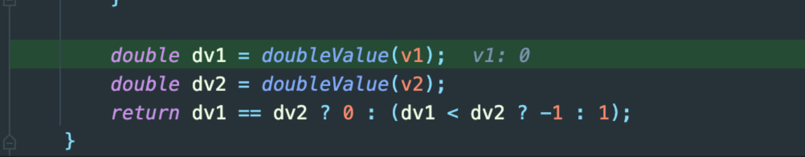
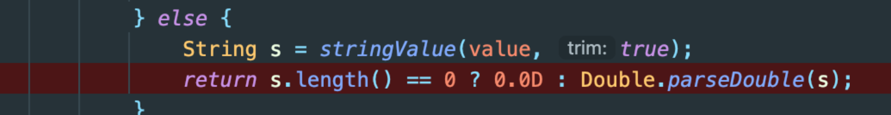

### 어느 날 일어난 장애  

```  
<if test="identityNo != null AND identityNo neq ''.toString()">
   AND identityNo = ...
</if>
```
- identityNo (long type)의 값이 0일 때, if의 조건문을 건너뛰어서 오류가 발생하였다.
   - 즉 저 조건문이 mybatis 상에서 false로 연산된 것이다.

### 0인데 왜 저 조건에 걸렸을까?
- 조건문이 작성된 형태에서 추측할 수 있는 가능성은 아래 2가지이다.
    - long type 0이면 null로 취급한다.
    - long type 0이면 빈 스트링(''.toString())으로 취급한다.
- 둘 중 어느 쪽도 직관적으로 이해되지는 않았지만... 현상을 명확히 파악해보고 싶었다.

### Mybatis에서 테스트 코드 작성
- [Mybatis 3](https://github.com/mybatis/mybatis-3)
    - github에서 체크아웃 받은 후 테스트 클래스 작성하여 디버깅해 보았다.
  
```java  
package org.apache.ibatis.builder.xml.dynamic

class ExpressionEvalulatorTest {

    @Test
    void compareLong() {
        class TestBO {
            public long identityNo = 0L;
        }

        assertFalse(evaluator.evaluateBoolean("identityNo == null",
        new TestBO()));

        assertTrue(evaluator.evaluateBoolean("identityNo != null",
        new TestBO()));

        assertTrue(evaluator.evaluateBoolean("identityNo eq ''.toString()",
            new TestBO()));

        assertFalse(evaluator.evaluateBoolean("identityNo neq ''.toString()",
        new TestBO()));

    }

}

```  
- 즉, long type 0 값은 null은 아니지만 빈 스트링과 비교했을 때는 동일하다는 결과가 나온다.

### 값을 비교하는 로직
- 저 비교 과정을 디버깅해 보면 Mybatis 내부적으로 Ognl이라는 라이브러리를 사용한다.
- OgnlOps의 compareWithConversion 이라는 메소드 내부를 보면 여러 가지 케이스에 대해 비교하다가, 제일 마지막 케이스에는 값을 모두 double 로 변환해서 비교하는 것을 확인할 수 있다.

- 그런데 이 doubleValue는 놀랍게도 파라미터의 길이가 0이면 0.0D로 값을 변환한다.


- 그래서 위의 identityNo (long type 0) 과 ''.toString (String -> doubleValue를 통해 0으로 변환됨)이 동일하다는 결과가 나오게 되는 것이다.

### 느낀점
- 변수의 값으로 들어갈 수 있는 값들에 대해서는 가능한 한 테스트로 동작을 검증하는 것이 보다 안정적이다. (이 케이스에 대해서는 인수테스트 등도 한가지 방안이 될 수 있을 것 같다)

---
{: data-content="footnotes"}
